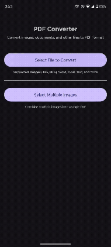

# PDF Converter Library
[](https://kotlinlang.org/)
[](LICENSE)
[](#)
[](#)

**A powerful and flexible PDF Converter library for Android** that converts multiple file formats to PDF including Images, Word documents (DOC/DOCX), Excel spreadsheets (XLS/XLSX), and Text files.

---

### Demo Video
<div align="center">
  
</div>

---

## Features

- **Multiple Format Support** – Convert Images, Word, Excel, and Text files to PDF
- **Batch Image Conversion** – Combine multiple images into a single PDF
- **Word Document Support** – Full support for DOC and DOCX with text and images
- **Excel Spreadsheet Support** – Convert Excel files with proper table formatting
- **Image Preservation** – Maintains image quality and aspect ratio in Word documents
- **Automatic File Management** – Handles file creation and storage automatically
- **Asynchronous Processing** – Non-blocking conversions with callbacks
- **Easy Integration** – Simple API with singleton pattern

---

## Supported Formats

| Format | Extensions | Features |
|--------|-----------|----------|
| **Images** | JPG, PNG, JPEG, BMP | Single or multiple images, auto-scaling |
| **Word Documents** | DOC, DOCX | Text extraction, embedded images, formatting |
| **Excel Spreadsheets** | XLS, XLSX | Table borders, column width calculation, multi-sheet support |
| **Text Files** | TXT | Plain text with word wrapping |
| **PDF** | PDF | Pass-through (copies existing PDF) |

---

## Installation

### **Step 1: Add JitPack Repository**

```gradle
dependencyResolutionManagement {
    repositories {
        google()
        mavenCentral()
        maven { url 'https://jitpack.io' }
    }
}
```

### **Step 2: Add Library Dependency**

```gradle
dependencies {
	        implementation("com.github.Excelsior-Technologies-Community:AndroidPDFConverter:1.0.0")
}
```

### **Step 3: Add Permissions to AndroidManifest.xml**

```xml
<uses-permission
    android:name="android.permission.READ_EXTERNAL_STORAGE"
    android:maxSdkVersion="32" />
<uses-permission
    android:name="android.permission.WRITE_EXTERNAL_STORAGE"
    android:maxSdkVersion="29"
    tools:ignore="ScopedStorage" />
```

### **Step 4: Add FileProvider**

```xml
<provider
    android:name="androidx.core.content.FileProvider"
    android:authorities="${applicationId}.fileprovider"
    android:exported="false"
    android:grantUriPermissions="true">
    <meta-data
        android:name="android.support.FILE_PROVIDER_PATHS"
        android:resource="@xml/file_paths" />
</provider>
```

### **Step 5: Create file_paths.xml**

```xml
<?xml version="1.0" encoding="utf-8"?>
<paths>
    <external-files-path
        name="pdf_files"
        path="Documents/PDFs/" />
</paths>
```

---

## Quick Start

### 1. Initialize the Converter

```kotlin
private lateinit var pdfConverter: PdfConverter

override fun onCreate(savedInstanceState: Bundle?) {
    super.onCreate(savedInstanceState)
    setContentView(R.layout.activity_main)
    
    pdfConverter = PdfConverter.getInstance()
}
```

### 2. Convert a File

```kotlin
// File picker launcher
private val filePickerLauncher = registerForActivityResult(
    ActivityResultContracts.GetContent()
) { uri ->
    uri?.let { convertFile(it) }
}

// Trigger file picker
filePickerLauncher.launch("*/*")

// Convert the selected file
private fun convertFile(fileUri: Uri) {
    pdfConverter.convertToPdf(
        context = this,
        fileUri = fileUri,
        outputFileName = "converted_${System.currentTimeMillis()}",
        callback = object : PdfConverter.ConversionCallback {
            override fun onSuccess(result: ConversionResult) {
                runOnUiThread {
                    Toast.makeText(
                        this@MainActivity,
                        "PDF created: ${result.outputFile.name}",
                        Toast.LENGTH_LONG
                    ).show()
                    
                    // Open the PDF
                    pdfConverter.openPdf(this@MainActivity, result.outputFile)
                }
            }
            
            override fun onError(error: String) {
                runOnUiThread {
                    Toast.makeText(
                        this@MainActivity,
                        "Error: $error",
                        Toast.LENGTH_LONG
                    ).show()
                }
            }
        }
    )
}
```

### 3. Convert Multiple Images

```kotlin
// Multiple images picker
private val multipleImagesLauncher = registerForActivityResult(
    ActivityResultContracts.GetMultipleContents()
) { uris ->
    if (uris.isNotEmpty()) {
        convertImages(uris)
    }
}

// Trigger image picker
multipleImagesLauncher.launch("image/*")

// Convert multiple images
private fun convertImages(imageUris: List<Uri>) {
    pdfConverter.convertImagesToPdf(
        context = this,
        imageUris = imageUris,
        outputFileName = "images_${System.currentTimeMillis()}",
        callback = object : PdfConverter.ConversionCallback {
            override fun onSuccess(result: ConversionResult) {
                runOnUiThread {
                    Toast.makeText(
                        this@MainActivity,
                        "Created PDF with ${imageUris.size} images",
                        Toast.LENGTH_LONG
                    ).show()
                    pdfConverter.openPdf(this@MainActivity, result.outputFile)
                }
            }
            
            override fun onError(error: String) {
                runOnUiThread {
                    Toast.makeText(this@MainActivity, "Error: $error", Toast.LENGTH_LONG).show()
                }
            }
        }
    )
}
```

---

## API Reference

### PdfConverter Methods

| Method | Parameters | Description |
|--------|-----------|-------------|
| `getInstance()` | - | Get singleton instance |
| `convertToPdf()` | context, fileUri, outputFileName, callback | Convert any file to PDF |
| `convertImagesToPdf()` | context, imageUris, outputFileName, callback | Convert multiple images to PDF |
| `openPdf()` | context, file | Open PDF with default viewer |

### ConversionCallback Interface

```kotlin
interface ConversionCallback {
    fun onSuccess(result: ConversionResult)
    fun onError(error: String)
}
```

### ConversionResult Data Class

```kotlin
data class ConversionResult(
    val success: Boolean,
    val outputFile: File,
    val message: String
)
```

---

## Complete Example

### XML Layout (activity_main.xml)

```xml
<?xml version="1.0" encoding="utf-8"?>
<androidx.constraintlayout.widget.ConstraintLayout 
    xmlns:android="http://schemas.android.com/apk/res/android"
    xmlns:app="http://schemas.android.com/apk/res-auto"
    android:layout_width="match_parent"
    android:layout_height="match_parent"
    android:padding="16dp">

    <TextView
        android:id="@+id/tvTitle"
        android:layout_width="wrap_content"
        android:layout_height="wrap_content"
        android:layout_marginTop="32dp"
        android:text="PDF Converter"
        android:textSize="24sp"
        android:textStyle="bold"
        app:layout_constraintEnd_toEndOf="parent"
        app:layout_constraintStart_toStartOf="parent"
        app:layout_constraintTop_toTopOf="parent" />

    <Button
        android:id="@+id/btnSelectFile"
        android:layout_width="0dp"
        android:layout_height="wrap_content"
        android:layout_marginTop="48dp"
        android:text="Select File to Convert"
        android:textSize="16sp"
        app:layout_constraintEnd_toEndOf="parent"
        app:layout_constraintStart_toStartOf="parent"
        app:layout_constraintTop_toBottomOf="@id/tvTitle" />

    <Button
        android:id="@+id/btnSelectMultipleImages"
        android:layout_width="0dp"
        android:layout_height="wrap_content"
        android:layout_marginTop="24dp"
        android:text="Select Multiple Images"
        android:textSize="16sp"
        app:layout_constraintEnd_toEndOf="parent"
        app:layout_constraintStart_toStartOf="parent"
        app:layout_constraintTop_toBottomOf="@id/btnSelectFile" />

</androidx.constraintlayout.widget.ConstraintLayout>
```

### MainActivity.kt

```kotlin
class MainActivity : AppCompatActivity() {

    private lateinit var pdfConverter: PdfConverter

    private val filePickerLauncher = registerForActivityResult(
        ActivityResultContracts.GetContent()
    ) { uri ->
        uri?.let {
            pdfConverter.convertToPdf(
                context = this,
                fileUri = it,
                outputFileName = "converted_${System.currentTimeMillis()}",
                callback = conversionCallback
            )
        }
    }

    private val multipleImagesLauncher = registerForActivityResult(
        ActivityResultContracts.GetMultipleContents()
    ) { uris ->
        if (uris.isNotEmpty()) {
            pdfConverter.convertImagesToPdf(
                context = this,
                imageUris = uris,
                outputFileName = "images_${System.currentTimeMillis()}",
                callback = conversionCallback
            )
        }
    }

    private val conversionCallback = object : PdfConverter.ConversionCallback {
        override fun onSuccess(result: ConversionResult) {
            runOnUiThread {
                Toast.makeText(
                    this@MainActivity,
                    "PDF created successfully!",
                    Toast.LENGTH_SHORT
                ).show()
                pdfConverter.openPdf(this@MainActivity, result.outputFile)
            }
        }

        override fun onError(error: String) {
            runOnUiThread {
                Toast.makeText(this@MainActivity, "Error: $error", Toast.LENGTH_LONG).show()
            }
        }
    }

    override fun onCreate(savedInstanceState: Bundle?) {
        super.onCreate(savedInstanceState)
        setContentView(R.layout.activity_main)

        pdfConverter = PdfConverter.getInstance()

        findViewById<Button>(R.id.btnSelectFile).setOnClickListener {
            filePickerLauncher.launch("*/*")
        }

        findViewById<Button>(R.id.btnSelectMultipleImages).setOnClickListener {
            multipleImagesLauncher.launch("image/*")
        }
    }
}
```

---

## Converter Features

### Word to PDF Converter
- ✅ Extracts text from DOC and DOCX files
- ✅ Preserves embedded images with auto-scaling
- ✅ Maintains document structure
- ✅ Handles multi-page documents
- ✅ Word wrapping for long lines

### Excel to PDF Converter
- ✅ Renders data in table format with borders
- ✅ Auto-calculates column widths
- ✅ Header row with bold text and gray background
- ✅ Supports multiple sheets
- ✅ Landscape orientation for better viewing
- ✅ Repeats header on new pages

### Image to PDF Converter
- ✅ Maintains image quality and aspect ratio
- ✅ Auto-scales large images to fit page
- ✅ Combines multiple images into single PDF
- ✅ Supports JPG, PNG, JPEG, BMP formats

### Text to PDF Converter
- ✅ Simple text extraction
- ✅ Word wrapping for readability
- ✅ Multi-page support

---

## File Output Location

PDFs are saved to:
```
/Android/data/[your.package.name]/files/Documents/PDFs/
```

Files are automatically opened after conversion using the system's default PDF viewer.

---

## Error Handling

The library handles common errors:
- Invalid file formats
- Corrupted files
- Empty files
- Permission issues
- Memory constraints

All errors are returned through the `onError()` callback.

---

## Requirements

- **Minimum SDK:** 21 (Android 5.0)
- **Target SDK:** 34
- **Language:** Kotlin 1.9+
- **Dependencies:** Apache POI 5.2.3, AndroidX Core

---

## Sample Project Structure

```
app/
├── src/main/
│   ├── java/com/ext/
│   │   ├── pdf_converter/
│   │   │   ├── PdfConverter.kt
│   │   │   ├── WordToPdfConverter.kt
│   │   │   ├── ExcelToPdfConverter.kt
│   │   │   ├── ImageToPdfConverter.kt
│   │   │   ├── TextToPdfConverter.kt
│   │   │   └── ConversionResult.kt
│   │   └── pdfconverter/
│   │       └── MainActivity.kt
│   ├── res/
│   │   ├── layout/
│   │   │   └── activity_main.xml
│   │   └── xml/
│   │       └── file_paths.xml
│   └── AndroidManifest.xml
└── build.gradle
```

---

## Performance Tips

1. **Large Files**: The library processes files asynchronously but large Excel files may take time
2. **Multiple Images**: Limit to 20-30 images per PDF for optimal performance
3. **Word Documents**: Complex documents with many images may require more processing time
4. **Memory**: The library handles memory efficiently but very large files may require more heap space

---

## Troubleshooting

### Issue: "Failed to extract text from Word document"
**Solution**: Ensure the Word file is not corrupted and is in DOC/DOCX format

### Issue: Excel table not rendering properly
**Solution**: The library displays up to 10 columns. Files with more columns will truncate

### Issue: Images not showing in Word PDF
**Solution**: Ensure images are properly embedded in the Word document, not linked

### Issue: FileProvider error
**Solution**: Verify `file_paths.xml` is created and FileProvider is added to manifest

---

## License

```
MIT License

Copyright (c) 2025 Excelsior Technologies

Permission is hereby granted, free of charge, to any person obtaining a copy
of this software and associated documentation files (the "Software"), to deal
in the Software without restriction, including without limitation the rights
to use, copy, modify, merge, publish, distribute, sublicense, and/or sell
copies of the Software, and to permit persons to whom the Software is
furnished to do so, subject to the following conditions:

The above copyright notice and this permission notice shall be included in all
copies or substantial portions of the Software.

THE SOFTWARE IS PROVIDED "AS IS", WITHOUT WARRANTY OF ANY KIND, EXPRESS OR
IMPLIED, INCLUDING BUT NOT LIMITED TO THE WARRANTIES OF MERCHANTABILITY,
FITNESS FOR A PARTICULAR PURPOSE AND NONINFRINGEMENT. IN NO EVENT SHALL THE
AUTHORS OR COPYRIGHT HOLDERS BE LIABLE FOR ANY CLAIM, DAMAGES OR OTHER
LIABILITY, WHETHER IN AN ACTION OF CONTRACT, TORT OR OTHERWISE, ARISING FROM,
OUT OF OR IN CONNECTION WITH THE SOFTWARE OR THE USE OR OTHER DEALINGS IN THE
SOFTWARE.
```

---
